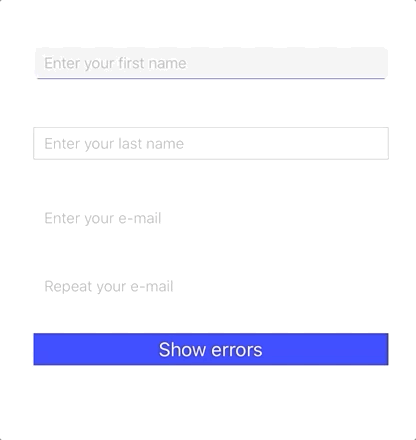

# ETTextField

_Last revision: 15.7.2020_

ETTextField is an extension of traditional UITextField which simplifies its customization and event handling. To get a quick idea jump to example section below!



## Features
- Fully customizable UI (colors, borders, insets, etc.)
- Floating title when user starts typing
- Error messages below text field with custom tint color
- Observation of user interaction with ETBinding events

## Usage `ETTextField`
### Create style for your text field with `TextFieldStyle`:
```swift
let style = TextFieldStyle(
    background: UIColor(white: 245.0/255.0, alpha: 1),
    font: UIFont.systemFont(ofSize: 14, weight: .light),
    tintColor: .blue,
    cornerRadius: 5.0,
    insets: UIEdgeInsets(top: 0, left: 10, bottom: 0, right: 10),
    border: [.bottom],
    borderColor: .blue
)
```
### Setup text field:
```swift
let textField = ETTextField()
textField.update(with: style)
textField.placeholder = "Enter your first name"
textField.title = "YOUR FIRST NAME:"
textField.titleOffset = -3.0
view.addSubview(textField)
```
### Observe user interaction:
```swift
textField.onDidBeginEditing.observe(owner: label) {
    // When user starts editing
}
textField.onDidEndEditing.observe(owner: label) {
    // When user ends editing
}
textField.onDidChangeText.observe(owner: label) { text in
    // When input text changes
}
textField.onReturnKeyPressed.observe(owner: self) {
    // When user hits return
}
```

### Error messages:
#### Show
```swift
textField.showError(message: "Error example")
```

#### Hide
The error message is automatically hidden if any change occurs on the `textField`. 

You can explicitly hide the error message:
```swift
textField.hideError()
```

## Usage `ETCustomErrorTextField`

### Setup text field:
The difference from `ETTextField` is that you can inject custom view and optionaly custom error icon that will be displayed on the right side of the field.
There's also the possibility to show custom error view only while user edits the textfield. For this you need to call `showError(onFocusOnly: true)`.
```swift
let textField = ETCustomErrorTextField(errorView: self.makeCustomErrorView())
```
or with custom error icon
```swift
let textField = ETCustomErrorTextField(errorView: self.makeCustomErrorView(), errorIcon: UIImage(named: "ic_error_icon"))
```


For more info see included example project.

## Installation

### Carthage

Add `github "EtneteraMobile/ETTextField"` to your Cartfile.

### Swift Package Manager

In Xcode (>11.0) go to File -> Swift Packages -> Add Package Dependency. There insert `https://github.com/EtneteraMobile/ETTextField` in URL input and finish importing `ETTextField` to your project.

## Contributing

Contributions to ETTextField are welcomed and encouraged!

## License

ETTextField is available under the MIT license. See [LICENSE](LICENSE) for more information.
